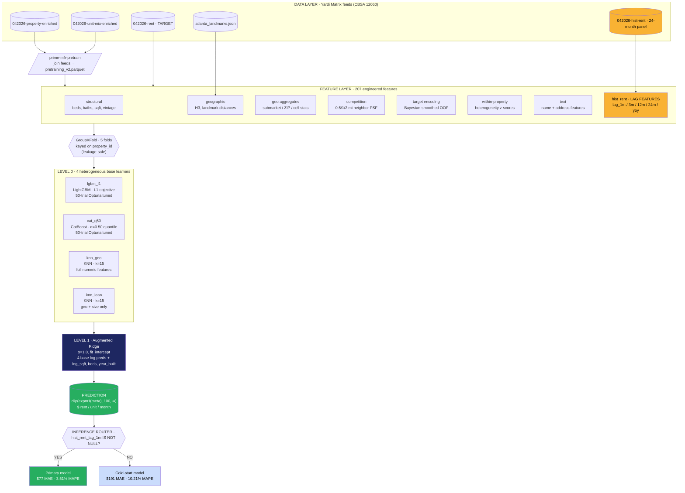
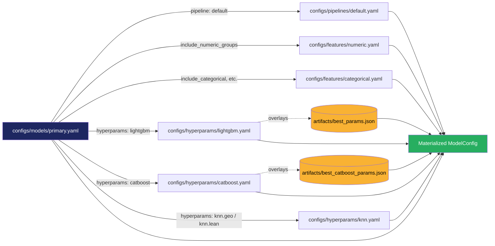

<<<<<<< HEAD
# forty5park-primemfr
=======
# prime-mfr

> Atlanta multifamily rent prediction pipeline. Yardi Matrix → feature engineering → 4-base stacked ensemble → unit-level rent predictions at $77 MAE (3.51% MAPE) on out-of-fold cross-validation.

**MSA:** Atlanta-Sandy Springs-Alpharetta, GA (CBSA 12060)
**Data vendor:** Yardi Matrix
**Stack:** Python 3.10+, LightGBM, CatBoost, scikit-learn, Optuna, YAML-driven configs

---

## Headline Results (5-fold GroupKFold OOF)

| Model variant | MAE | MAPE | MedianAPE | R² | Use case |
|---|---:|---:|---:|---:|---|
| **Primary** | **$76.67** | **3.51%** | **1.77%** | 0.87 | Repricing units with rent history (~86% of portfolio) |
| **Cold-Start** | $191.25 | 10.21% | 7.94% | 0.79 | New construction, acquisitions, comp pricing |
| **Graceful** | $89 / $185 | 4.25% / 9.91% | 2.72% / 7.82% | 0.87 / 0.79 | Unified single-model fallback |

See [`docs/results.md`](docs/results.md) for the full writeup, [`docs/ml_stack_spec.md`](docs/ml_stack_spec.md) for the ML internals, and [`docs/feature_engineering_spec.md`](docs/feature_engineering_spec.md) for the feature-engineering reference.

---

## Quick Start

This project uses [**uv**](https://docs.astral.sh/uv/) for Python environment + dependency management. uv is significantly faster than pip and creates a fully-reproducible `uv.lock` checked into the repo.

> **⚠️ Where to run these commands:** every command below must be run from the **repo root** — the directory that contains `pyproject.toml`, `uv.lock`, and this `README.md`. If you cloned into `~/code/prime-mfr`, then `cd ~/code/prime-mfr` first. `uv` looks for the project by walking up from the current directory, so it will fail loudly with a clear error if you're in the wrong place.

```bash
# 0. Navigate to the repo root (the directory containing pyproject.toml).
cd path/to/prime-mfr

# 1. Install uv (one-time, if not already installed).
#    Skip this step if `uv --version` already works.
curl -LsSf https://astral.sh/uv/install.sh | sh

# 2. Sync the virtual environment from uv.lock (creates .venv/ in the repo root).
#    Run this from the repo root.
uv sync

# 3. List available model variants (from the repo root).
uv run prime-mfr list

# 4. Train the primary model end-to-end (≈3 min, single machine).
uv run prime-mfr train --model primary

# 5. Check training status at any time.
uv run prime-mfr status

# 6. Re-fit the meta-learner + dump metrics.
uv run prime-mfr evaluate --model primary

# 7. Run the test suite.
uv run pytest

# 8. Wipe generated outputs and start fresh.
uv run prime-mfr clean --yes
```

> **About `uv run`**: it executes a command inside the project's `.venv` without requiring you to activate it manually. You can also `source .venv/bin/activate` once per shell session, then drop the `uv run` prefix from each command. Either way, **stay in the repo root** — CLI commands assume file paths relative to it (e.g., `configs/models/primary.yaml`).

**Longer walk-through** with troubleshooting, cleanup, and dev-loop tips: [`docs/tutorial_local_setup.md`](docs/tutorial_local_setup.md).

### pip fallback

If your team can't install uv (locked-down workstation, etc.), the project also ships a standard `[project.optional-dependencies]` block, so `pip install -e ".[dev]"` still works. uv is recommended; pip is supported.

---

## End-to-End Architecture



**Why the historical-rent panel is highlighted in gold:** the breakthrough that moved OOF MAE from $191 → $77 was integrating the 24-month historical rent panel as lag features. Five lags (1m / 3m / 12m / 24m / yoy) contributed $114 of the $145 cumulative improvement vs. the original tuned single-model baseline. Pearson correlation of `lag_1m` with the target is 0.94. See [`docs/results.md`](docs/results.md) for the ablation that rules out backfill leakage.

---

## Repository Layout

```
prime-mfr/
├── src/prime_mfr/                    # Installable package (src-layout)
│   ├── __init__.py
│   ├── __version__.py
│   │
│   ├── core/                         # Shared infrastructure
│   │   ├── paths.py                  # PROJECT_DIR, ARTIFACTS_DIR, CONFIGS_DIR
│   │   └── settings.py               # YAML config loader (ModelConfig, PipelineConfig)
│   │
│   ├── features/                     # Feature engineering subpackage
│   │   ├── engineering.py            # Legacy monolith (structural, geo, TE, etc.)
│   │   └── hist_rent.py              # Extracted: historical lag features
│   │
│   ├── config.py                     # Backward-compat constants
│   ├── data_processing.py            # Source-data loaders + cleaners
│   ├── feature_engineering.py        # Backward-compat shim → features/
│   ├── models.py                     # Trainer registry (lightgbm / catboost / knn)
│   ├── train.py                      # Fold prep + log-target + metrics
│   │
│   ├── pipeline/
│   │   └── stacked_cv.py             # Production stacked-CV runner
│   ├── tuning/
│   │   ├── lightgbm.py               # Optuna search · LightGBM
│   │   └── catboost.py               # Optuna search · CatBoost
│   ├── evaluation/
│   │   └── error_segmentation.py     # Post-CV residual analysis
│   ├── pretraining/
│   │   └── build_v2.py               # Yardi feed join → pretraining_v2.parquet
│   │
│   └── cli/                          # Unified CLI (`prime-mfr <subcommand>`)
│       ├── main.py
│       └── commands/                 # train / status / evaluate / predict / ablate / tune / list
│
├── configs/                          # Declarative YAML configs
│   ├── models/                       # Model variants (primary, cold_start, graceful)
│   ├── features/                     # Feature group definitions
│   ├── hyperparams/                  # LightGBM, CatBoost, KNN configs
│   └── pipelines/                    # CV settings, training knobs
│
├── tests/                            # pytest suite (50 tests, ~3s)
│   ├── conftest.py
│   ├── fixtures/                     # pre_engineered_sample.parquet (DE handoff fixture)
│   ├── test_config.py                # YAML loader + ModelConfig assembly
│   ├── test_features.py              # Hist-rent leakage, schema, merge
│   ├── test_feature_contract.py      # DE-handoff schema validator
│   ├── test_feature_geographic.py    # Landmark distances, H3 cells, haversine
│   ├── test_metrics.py               # MAE/MAPE/R², log-target round-trip
│   └── test_smoke.py                 # Import + registry + CLI sanity
│
├── docs/
│   ├── results.md                    # Technical results writeup
│   ├── ml_stack_spec.md              # ML architecture + design rationale
│   ├── feature_engineering_spec.md   # Feature-by-feature reference for DE re-implementation
│   └── feature_pipeline_contract.md  # DE handoff contract (schema + validator)
│
├── artifacts/                        # Tuned hyperparams, source parquets, metrics, OOF preds
├── eda/                              # Curated reference data (atlanta_landmarks.json)
├── pyproject.toml                    # Package metadata + console_scripts + tool config
├── uv.lock                           # uv-resolved dependency lock
├── README.md
└── LICENSE
```

---

## CLI Reference

```bash
prime-mfr <subcommand> [options]
```

| Subcommand | Description |
|---|---|
| `prime-mfr list` | List available model variants from `configs/models/`. |
| `prime-mfr train --model NAME` | Train a model variant end-to-end. `NAME` ∈ {primary, cold_start, graceful}. |
| `prime-mfr train --model NAME --fold N --base BASE` | Train one base learner on one fold (dev iteration). |
| `prime-mfr status` | Show which folds × bases are complete. |
| `prime-mfr evaluate --model NAME` | Re-fit meta-learner + write metrics from existing OOF state. |
| `prime-mfr predict --input X.parquet --output Y.parquet` | Batch inference (planned — inference layer not yet built). |
| `prime-mfr ablate --model NAME --drop FEAT` | Train with a feature removed (planned). |
| `prime-mfr tune --base lightgbm --trials 50` | Run Optuna hyperparameter search. |

Lower-level scripts (for backward compatibility and direct access):

| Script | Description |
|---|---|
| `prime-mfr-pipeline {prep,foldprep,train,fold,meta,status}` | Direct access to the stacked-CV runner. |
| `prime-mfr-tune-lgb` / `prime-mfr-tune-cb` | Standalone tuners. |
| `prime-mfr-segment` | Error segmentation report from existing OOF predictions. |
| `prime-mfr-pretrain` | Build `pretraining_v2.parquet` from Yardi feeds. |

---

## Model Variants

Each variant is a YAML file in `configs/models/`. To add a new variant, write a new YAML file — no Python code changes.

| File | Variant | Hist features | Nullification | Use case |
|---|---|---|---|---|
| `configs/models/primary.yaml` | primary | included | none | Repricing |
| `configs/models/cold_start.yaml` | cold_start | dropped | none | New construction / acquisitions |
| `configs/models/graceful.yaml` | graceful | included | 30% of training rows | Unified single endpoint |

Example minimal model config:

```yaml
name: primary
pipeline: default
features:
  include_numeric_groups: [unit_structural, property_structural, geographic, historical_lags]
  include_categorical: true
  include_target_encoding: true
bases:
  - {name: lgbm_l1, trainer: lightgbm, hyperparams: lightgbm, overrides: {objective: regression_l1}}
  - {name: cat_q50, trainer: catboost, hyperparams: catboost}
  - {name: knn_geo, trainer: knn, hyperparams: knn.geo}
  - {name: knn_lean, trainer: knn, hyperparams: knn.lean}
meta:
  type: aug_ridge
  alpha: 1.0
  context_features: [log_sqft, beds, year_built]
```

---

## Working with YAML Configs

All model variants, feature groups, hyperparameters, and pipeline settings live in `configs/` as YAML. **Editing a model = editing a YAML file. You should not need to touch Python code to add a feature, change a hyperparameter, or define a new variant.**

If you've never used YAML before, it's a human-readable text format that maps cleanly to dictionaries and lists. Key things to know:

| YAML | What it is | Python equivalent |
|---|---|---|
| `key: value` | A key/value pair | `{"key": "value"}` |
| `- item` (with leading dash) | An item in a list | `["item"]` |
| Two-space indentation | Defines nesting | nested dicts |
| `# anything` | Comment (ignored by the parser) | `# anything` |
| `"foo"` or `foo` | A string (quotes optional unless it has `:` or `#`) | `"foo"` |
| `42` / `3.14` / `true` / `null` | Numbers, booleans, null | `42`, `3.14`, `True`, `None` |

Three gotchas that bite people:

1. **Indentation is significant** — always use 2 spaces, never tabs.
2. **Lists vs. dicts** — `[a, b, c]` is a list; `{a: 1, b: 2}` is a dict. Mixing them is a parse error.
3. **Booleans are lowercase** — `true` / `false`, not `True` / `False`.

### The `configs/` tree

```
configs/
├── pipelines/
│   └── default.yaml              # CV settings, target transform, training loop knobs
│
├── features/
│   ├── numeric.yaml              # Numeric-feature catalog, organized into named groups
│   └── categorical.yaml          # Categorical / boolean / text / target-encode features
│
├── hyperparams/
│   ├── lightgbm.yaml             # LightGBM defaults + tuned values (Optuna output)
│   ├── catboost.yaml             # CatBoost defaults
│   └── knn.yaml                  # KNN-geo and KNN-lean settings (two variants)
│
└── models/
    ├── primary.yaml              # The production repricing model
    ├── cold_start.yaml           # No historical-rent features
    └── graceful.yaml             # Random hist-feature nullification at 30%
```

### How configs compose

When you run `prime-mfr train --model primary`, the loader assembles a `ModelConfig` by following references:



The dotted lines show **artifact overrides**: the loader reads the tuned hyperparameters from `artifacts/best_params.json` and `artifacts/best_catboost_params.json` and overlays them on top of the YAML defaults. So the tuned values from your last Optuna run automatically win. If the artifact file is missing, the YAML defaults are used as-is.

### Schema reference

#### `configs/models/<name>.yaml`

The most important file. A model variant looks like this:

```yaml
name: primary                          # required — used to find this file
description: "Repricing model"         # free-form, shown in `prime-mfr list`
pipeline: default                      # which configs/pipelines/<name>.yaml to use

features:
  # Numeric features come from named groups defined in features/numeric.yaml.
  # The loader resolves group names and flattens them into one list.
  include_numeric_groups:
    - unit_structural
    - property_structural
    - geographic
    - historical_lags

  # These boolean toggles include whole blocks from features/categorical.yaml.
  include_categorical: true            # the `categorical` list
  include_booleans: true               # the `booleans` list
  include_ordinal_grade: true          # the `ordinal_grade` list
  include_text_features: true          # both `text_booleans` and `text_numerics`
  include_target_encoding: true        # the `target_encode` list

bases:                                 # The base learners in the stacked ensemble.
  - name: lgbm_l1                      # arbitrary nickname
    trainer: lightgbm                  # which trainer in models.TRAINERS to use
    hyperparams: lightgbm              # which configs/hyperparams/*.yaml file
    overrides:                         # any per-base hyperparam overrides
      objective: regression_l1
    seed_offset: 0                     # adds to RANDOM_STATE for this base

  - name: knn_geo
    trainer: knn
    hyperparams: knn.geo               # dotted ref → knn.yaml::geo section

meta:                                  # The level-1 meta-learner.
  type: aug_ridge                      # or `ridge`
  alpha: 1.0
  positive: false
  fit_intercept: true
  context_features:                    # raw features appended to the meta input matrix
    - log_sqft
    - beds
    - year_built

training:
  nullification:                       # Random NaN injection during training (graceful variant).
    enabled: false                     # set true to enable
    columns:                           # which columns to nullify
      - hist_rent_lag_1m
    fraction: 0.30                     # what % of training rows
    seed: 20260501                     # deterministic per-fold

artifacts:                             # where this variant writes its outputs
  state_path: artifacts/stacking_scratch/oof_state.pkl
  metrics_path: artifacts/metrics.json
  predictions_path: artifacts/oof_predictions.parquet
```

#### `configs/features/numeric.yaml`

A catalog of numeric features, organized into named groups. Model configs include groups, not individual features:

```yaml
groups:
  unit_structural:                     # group name — referenced from model YAML
    - sqft
    - beds
    - baths
  geographic:
    - latitude
    - longitude
    - dist_buckhead_km
  historical_lags:                     # the "hist rent" group
    - hist_rent_lag_1m
    - hist_rent_lag_3m
    - hist_rent_lag_12m
    - hist_rent_lag_24m
    - hist_rent_yoy
```

To make a column available as a feature: add it to a group. To remove it from a specific variant: drop the group from `include_numeric_groups` in that variant's model YAML.

#### `configs/features/categorical.yaml`

Flat lists per type. Model variants opt in/out by setting `include_<type>: true|false` in their YAML:

```yaml
categorical:
  - unit_type
  - sub_market
  - zipcode

booleans:
  - has_fitness_center
  - has_clubhouse

target_encode:                         # Bayesian-smoothed OOF target encoding
  - sub_market
  - zipcode
```

#### `configs/hyperparams/lightgbm.yaml`

Two blocks: `fixed` (always applied) and `tuned` (Optuna best values, overlaid by `artifacts/best_params.json` if present):

```yaml
fixed:
  objective: regression_l1
  metric: mae
  verbosity: -1

tuned:                                 # the Optuna best values get overlaid here
  learning_rate: 0.04
  num_leaves: 63
  feature_fraction: 0.85
```

#### `configs/hyperparams/knn.yaml`

Two sub-sections because we ship two KNN variants:

```yaml
geo:                                   # referenced as `hyperparams: knn.geo`
  n_neighbors: 15
  weights: distance

lean:                                  # referenced as `hyperparams: knn.lean`
  n_neighbors: 25
  weights: distance
  feature_subset:                      # this KNN variant uses a tighter feature set
    - latitude
    - longitude
    - sqft
    - beds
```

#### `configs/pipelines/default.yaml`

CV settings, target transform, and training-loop knobs. Most variants will just reference `pipeline: default`:

```yaml
target:
  column: rent
  transform: log1p                     # one of: log1p, identity, log_psf

cv:
  strategy: group_kfold
  splits: 5
  group_key: property_id               # ALL units of a property stay in the same fold
  random_state: 42

training:
  num_boost_round: 4000
  early_stopping_rounds: 100
```

### Common recipes

**Add a new numeric feature to all models**

1. Implement the column in your feature engineering code so it shows up in the dataframe.
2. Add the column name to a group in `configs/features/numeric.yaml`.
3. Confirm that group is in your model's `include_numeric_groups`.

**Add a new model variant**

1. Copy an existing YAML: `cp configs/models/primary.yaml configs/models/my_experiment.yaml`.
2. Edit the `name`, `description`, and whatever you're changing.
3. Update `artifacts:` paths so this variant writes to its own files.
4. Run `prime-mfr list` to confirm it shows up.
5. Run `prime-mfr train --model my_experiment`.

**Change a LightGBM hyperparameter for one variant only**

In that variant's YAML, under the `lgbm_l1` base, add an `overrides:` block:

```yaml
bases:
  - name: lgbm_l1
    trainer: lightgbm
    hyperparams: lightgbm
    overrides:
      learning_rate: 0.02              # override just this hyperparam
      num_leaves: 127                  # override this too
      objective: regression_l1         # unchanged from base
```

The merge order is: `lightgbm.yaml::fixed` → `lightgbm.yaml::tuned` → `artifacts/best_params.json` → `overrides`. Later wins.

**Run an ablation (drop a feature group)**

Copy the model YAML and remove a group name from `include_numeric_groups`:

```yaml
# configs/models/no_competition.yaml
include_numeric_groups:
  - unit_structural
  - property_structural
  # - competition           ← commented out
  - geographic
  - historical_lags
```

**Adjust the meta-learner without touching code**

Change the `meta:` block:

```yaml
meta:
  type: ridge                          # use plain Ridge instead of Aug-Ridge
  alpha: 0.1                           # less regularization
  context_features: []                 # drop the augmented context features
```

**Validate your edits before training**

```bash
prime-mfr list                          # parses every model YAML; surfaces syntax errors
python -c "from prime_mfr.core import load_model_config; print(load_model_config('my_experiment'))"
```

If a YAML is malformed or references a missing group/hyperparam file, the loader raises a clear error before any training starts.

### Where YAML stops and Python begins

YAML is the right place to declare **what** the model is — features, hyperparams, blend weights, file paths. It is not the place for **how** something is computed. Things that stay in Python:

- Feature engineering implementations (`features/engineering.py`, `features/hist_rent.py`)
- Trainer functions (`models.py`)
- Meta-learner math (the Aug-Ridge fit in `pipeline/stacked_cv.py`)
- Brand lists, street-suffix maps, regex patterns (`config.py`)

If you find yourself wanting to put logic in YAML — conditionals, loops, function calls — you've gone past where YAML should be doing the work, and that logic belongs in Python.

---

## Development

```bash
# Install dev dependencies (dev group is included by default per [tool.uv])
uv sync

# Run tests
uv run pytest                        # all tests (50 tests, ~3s)
uv run pytest -v --cov               # verbose + coverage
uv run pytest -k feature             # tests matching pattern
uv run pytest -m "not slow"          # skip slow tests

# Format and lint
uv run black .
uv run ruff check .
uv run ruff check --fix .            # auto-fix what's fixable

# Add a new dependency
uv add pandera                        # adds to [project.dependencies], updates uv.lock
uv add --group dev pytest-xdist       # adds to dev group only

# Regenerate the lock file (e.g. after editing pyproject.toml directly)
uv lock

# Upgrade all packages within version constraints
uv lock --upgrade
```

Tests cover:

- **Config loader** (`tests/test_config.py`) — YAML loading, ModelConfig assembly, hyperparam merge precedence
- **Feature engineering** (`tests/test_features.py`) — hist-rent leakage check (target period must not appear in lags), schema, merge correctness
- **Metrics & transforms** (`tests/test_metrics.py`) — MAE/MAPE/R² formulas, log-target round-trip, prediction-floor clipping
- **Smoke** (`tests/test_smoke.py`) — every module imports, the trainer registry resolves, the CLI parses

---

## Source Data

Tracked in `artifacts/` for reproducibility from clone:

| File | Description |
|---|---|
| `artifacts/042026-property-enriched-12060.parquet` | Property-level features (lat/lon, vintage, amenities) |
| `artifacts/042026-unit-mix-enriched-12060.parquet` | Unit-mix breakdowns by property |
| `artifacts/042026-rent-12060.parquet` | Target rents at 2026-03-01 |
| `artifacts/042026-hist-rent-12060-12060.parquet` | 24-month historical rent panel (708,825 rows) |
| `pretraining_v2.parquet` | Pre-joined training table (built by `prime-mfr-pretrain` from the 4 source feeds) |
| `eda/atlanta_landmarks.json` | Curated landmark coordinates (Buckhead, Midtown, Downtown, ATL Airport, etc.) |

Tuned hyperparameter artifacts (outputs of `prime-mfr tune`):

| File | Description |
|---|---|
| `artifacts/best_params.json` | LightGBM (50-trial Optuna study) |
| `artifacts/best_catboost_params.json` | CatBoost (50-trial Optuna study) |

---

## Architecture Notes

The codebase deliberately separates three concerns:

| Concern | Where it lives |
|---|---|
| **Data layer** | `src/prime_mfr/data_processing.py`, `pretraining/build_v2.py` — Yardi-feed loading + cleaning + the join that produces `pretraining_v2.parquet` |
| **Feature layer** | `src/prime_mfr/features/` — `engineering.py` (static features) + `hist_rent.py` (lag features) + `contract.py` (DE-handoff schema validator) |
| **Model layer** | `src/prime_mfr/models.py` (trainers + registry) + `src/prime_mfr/train.py` (CV orchestration) + `pipeline/stacked_cv.py` (production runner) |

All variants (primary / cold-start / graceful) share these three layers and differ only in their YAML configs under `configs/models/`. See [`docs/ml_stack_spec.md`](docs/ml_stack_spec.md) for the full design rationale and [`docs/feature_engineering_spec.md`](docs/feature_engineering_spec.md) for the feature-by-feature reference.

**Planned but not yet built:**

- **Inference layer** (`src/prime_mfr/inference/`) — router (selects primary vs cold-start by feature availability) + predictor (loads saved model artifact + calls bases + meta).
- **Model registry** (`src/prime_mfr/registry/`) — ONNX + Parquet + JSON-based persistence for trained models with version pinning.

These are scoped but not implemented; `prime-mfr predict` is a stub until they ship.

Stages 1-4 deliver the "abstracts ML and data processing + simple centralized way of running models" goal from the design doc. Stages 5-6 are the production-inference and quality bar.

---

## License

Proprietary — Copyright (c) 2026 Forty5 Park. All Rights Reserved. See [`LICENSE`](LICENSE).
>>>>>>> 5ae702f (Initial commit)
