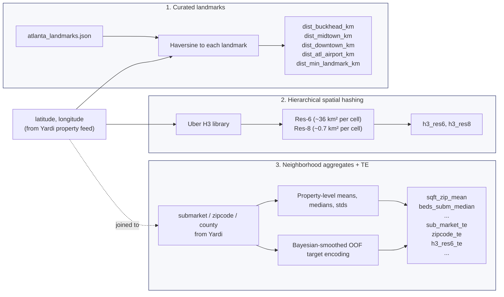

# Geospatial Feature Pipeline — POIs, Landmarks, H3 Cells, and Neighborhood Aggregates

> **Audience:** engineers extending the geographic feature set (new markets, new POI sources, new spatial features)
> **Companion docs:**
> - [`docs/feature_engineering_spec.md`](feature_engineering_spec.md) — every feature the model consumes (comprehensive)
> - [`docs/ml_stack_spec.md`](ml_stack_spec.md) — how these features are used inside the model

Location matters more than any single structural attribute in Atlanta multifamily pricing. This document explains **how the geospatial signal enters the model**, what the current pipeline captures, and where to plug in additional geographic intelligence (walk scores, transit access, school catchment, POIs).

---

## The three layers of geospatial signal

The model has three complementary ways to encode where a property is:



Each layer captures a different kind of spatial signal:

| Layer | What it encodes | Why the model needs it |
|---|---|---|
| **1. Curated landmarks** | Distance to specific important nodes (Buckhead CBD, Midtown, Downtown, Airport) | Rent gradient off high-value nodes is smooth and continuous — trees can split it cleanly |
| **2. H3 hashing** | Discrete cell membership at two resolutions | Trees split categoricals well; hard to split lat/lon scatter as effectively. Res-6 ≈ submarket, res-8 ≈ block |
| **3. Neighborhood aggregates + TE** | "What does this submarket/ZIP/cell typically look like and typically charge?" | Encodes the neighborhood context that pure lat/lon can't (submarket brand equity, ZIP-code demographics baked into rent) |

The three are complementary — dropping any one hurts OOF MAE.

---

## Layer 1 — Curated landmark distances

### The data

**File:** `eda/atlanta_landmarks.json`

A hand-curated JSON of 11 named landmarks (some in the active set, some available for experiments). Each entry has:

```json
{
  "buckhead": {
    "name": "Buckhead",
    "type": "neighborhood/business district",
    "latitude": 33.83942,
    "longitude": -84.37992,
    "source": "Wikipedia infobox - https://en.wikipedia.org/wiki/Buckhead",
    "wikipedia_dms": "33°50'22\"N 84°22'48\"W",
    "notes": "Northern uptown business district; high-end residential and commercial core."
  },
  ...
}
```

**Active landmarks** (referenced by `config.LANDMARKS`):

- `buckhead` — northern high-end business district
- `midtown` — urban core, GA Tech / Piedmont Park adjacent
- `downtown` — central business district
- `atl_airport` — Hartsfield-Jackson (proxy for southside employment and I-285 access)

**Other landmarks in the file (available for experimentation, not currently used):** Ponce City Market, Battery Atlanta, GA Tech, Emory, Perimeter Mall, etc.

### The math

For each property (row) and each landmark, compute the great-circle (Haversine) distance in kilometers:

```python
def haversine_km(lat1, lon1, lat2, lon2):
    R = 6371.0088                 # Earth's radius in km (WGS84 mean)
    lat1r, lat2r = radians(lat1), radians(lat2)
    dlat = radians(lat2 - lat1)
    dlon = radians(lon2 - lon1)
    a = sin(dlat/2)**2 + cos(lat1r) * cos(lat2r) * sin(dlon/2)**2
    return R * 2 * asin(sqrt(a))
```

**Output features:**
- One `dist_<landmark>_km` column per active landmark
- One aggregate `dist_min_landmark_km` = row-wise minimum across all landmark distances

The aggregate `dist_min_landmark_km` gives the model a "how far from anything important?" signal that's stronger than any single landmark distance alone.

### Why it works

Rent is a **smooth, continuous function of proximity to key nodes** in Atlanta. Properties within 3 km of Buckhead command a 30-50% premium over properties 8 km away; the gradient is monotonically decreasing.

Tree splits handle this well: `if dist_buckhead_km <= 4.2, go left; else go right`. But trees can't compose products across features, which is why we also inject `sqft × dist_buckhead_km` and `beds × dist_buckhead_km` as static interactions in `features/engineering.py::add_static_interactions`.

### Adding a new landmark

1. Add the entry to `eda/atlanta_landmarks.json` with `latitude`, `longitude`, `name`, `notes`.
2. Add the key to `LANDMARKS` in `src/prime_mfr/config.py`:

```python
LANDMARKS: list[str] = ["buckhead", "midtown", "downtown", "atl_airport", "ponce_city_market"]
```

3. Re-run `uv run prime-mfr clean --yes && uv run prime-mfr train --model primary`.

That's it — the pipeline picks up the new landmark automatically. A new `dist_ponce_city_market_km` column appears; the aggregate `dist_min_landmark_km` incorporates it; the model retrains with the new signal.

### Landmark selection guidance

Not every hand-curated point helps. Rules of thumb:

- **Pick landmarks with monotonic rent gradients.** If rent doesn't systematically increase/decrease with distance to a candidate landmark, it won't help.
- **Prefer nodes that are correlated with underlying demand** (employment centers, universities, cultural anchors) rather than sparse points-of-interest that happen to sit in specific submarkets.
- **Avoid redundancy.** A "Midtown" landmark and a "Georgia Tech" landmark 2 km apart will produce nearly identical distance columns. Prune to non-overlapping representative nodes.

### Multi-MSA reuse

For a new market (Dallas, Charlotte, etc.), the landmark file must be re-curated. Create `eda/dallas_landmarks.json`, update the config accordingly (or introduce a `configs/geographic/dallas.yaml` when that infrastructure is built).

---

## Layer 2 — H3 hierarchical spatial cells

### The data

Uber's H3 is a hierarchical hexagonal geospatial indexing system. Each cell has:
- A globally-unique 15-character hex string ID
- A hierarchical parent-child relationship (higher resolution = smaller cell)
- Neighbors at the same resolution accessible via `h3.grid_ring`

**Resolutions used:** 6 and 8.

| H3 res | Cell area | Analog |
|---|---|---|
| 6 | ~36 km² | Submarket-sized |
| 8 | ~0.7 km² | Neighborhood-block-sized |

Res-7 was tried and added no signal (redundant with res-6 and res-8). Res-9 was tried and overfit per-fold (too many cells with too few properties each).

### The transformation

```python
import h3
df["h3_res6"] = df.apply(lambda r: h3.latlng_to_cell(r["latitude"], r["longitude"], 6), axis=1)
df["h3_res8"] = df.apply(lambda r: h3.latlng_to_cell(r["latitude"], r["longitude"], 8), axis=1)
```

**Output:** two string categorical columns. `NaN` lat/lon rows get the literal string `"__missing__"` (its own category).

### Why it works

Trees split categoricals well but split geographic scatter poorly. By hashing (lat, lon) into a hierarchical hex grid, we hand the tree a categorical it can natively partition on.

**Res-6** gives the model "which submarket am I in?" without depending on the human-curated `sub_market` label (which is present in Yardi but coarse and sometimes ambiguous).

**Res-8** gives the model "which specific cluster of buildings am I in?" — useful when a submarket contains a high-rise cluster and a townhome cluster that price differently.

Combined with target encoding at each resolution (`h3_res6_te`, `h3_res8_te`), these features encode both "where" and "what does this area typically rent for."

### Warehouses without native H3

Snowflake doesn't have native H3 functions. Options for a data-engineering re-implementation:

- **Python UDF** wrapping `h3-py`. Most portable.
- **Carto's H3 functions** if you use BigQuery.
- **Pre-computed lookup table** mapping (rounded_lat, rounded_lon) → cell ID. Ships with the model artifact.

See `docs/feature_engineering_spec.md` for the exact function signatures and dtype expectations.

---

## Layer 3 — Neighborhood aggregates + OOF target encoding

### The data

Three geographic categoricals from Yardi:
- `sub_market` — Yardi-provided submarket label (e.g., "5 - Norcross", "22 - Kennesaw", "38 - Sandy Springs/Dunwoody")
- `zipcode` — 5-digit ZIP
- `county` — county name

### The transformations

**Sub-layer 3a: Geographic aggregates (~60 features)** — for each `(geo_level, alias)` × each numeric attribute × `{mean, median, std, count}`:

```python
# For each geo level (zip, submarket, county) and each attribute (sqft, beds, baths, age, num_units)
# aggregate at the PROPERTY level (not unit-row level) first, then merge back to unit rows.
for geo, alias in [("zipcode", "zip"), ("sub_market", "subm"), ("county", "cty")]:
    for n in ["sqft", "beds", "baths", "property_age", "num_units"]:
        grouped = property_df.groupby(geo)[n]
        df[f"{n}_{alias}_mean"]   = grouped.transform("mean")
        df[f"{n}_{alias}_median"] = grouped.transform("median")
        df[f"{n}_{alias}_std"]    = grouped.transform("std")
        df[f"{n}_{alias}_count"]  = grouped.transform("count")
```

The critical detail: **aggregate at the property level first**, then merge back onto unit rows. Aggregating unit-row-level would let 250-unit properties dominate the aggregate vs. 50-unit properties in the same ZIP.

3 geo levels × 5 attributes × 4 stats = **60 columns**.

**Sub-layer 3b: Z-score deviations (15 features)** — for each `(geo_level, alias)` × each numeric attribute:

```python
df[f"{n}_{alias}_z"] = (df[n] - df[f"{n}_{alias}_mean"]) / df[f"{n}_{alias}_std_safe"]
```

Encodes "how unusual is this unit relative to its neighborhood." A 1500-sqft unit in a 800-sqft-mean ZIP (z = +2.0) is a materially different beast than a 1500-sqft unit in a 1500-sqft-mean ZIP (z = 0.0).

**Sub-layer 3c: OOF target encoding (8 features)** — for `[sub_market, zipcode, h3_res6, h3_res8, unit_type, haystacks_unit_type, brand, street_type]`, compute smoothed target means using training-fold data only:

```python
# For each CV fold, using train rows only:
smoothed_mean(category) = (n_train * train_mean + prior * global_mean) / (n_train + prior)
```

With prior = 20. Submarkets with only 3 properties are pulled hard toward the global mean; submarkets with 200 properties keep their empirical mean.

The output columns are `sub_market_te`, `zipcode_te`, `h3_res6_te`, etc. — each becomes a numeric "expected rent for this category" the model consumes.

### Why it works

**Geographic aggregates** encode the physical profile of the neighborhood without any target leakage (no rent involved). They tell the model "in this ZIP, properties are typically 1200 sqft with 2 beds — you're looking at a 1500 sqft 3-bed, which is on the larger side."

**Z-score deviations** are the single most consistent trick from winning Kaggle solutions for tabular regression. They let the tree split on relative-to-neighborhood scores instead of absolute values, which generalizes better.

**Target encoding** is the classical trick for high-cardinality categoricals. Encoding submarket as an integer would be arbitrary; encoding it as "average rent in this submarket, Bayesian-smoothed" gives the model a directly-usable numeric signal that KNN bases can consume (they can't consume raw strings).

---

## What POI-based features we currently *don't* have

None of the following are in the production model — they're the highest-value gaps for future geographic work:

| Candidate feature | Rationale | Data source |
|---|---|---|
| **Transit access (distance to MARTA)** | Rail-adjacent properties command a premium in Midtown/Buckhead; irrelevant in the perimeter | OSM Overpass API: `railway=station operator=MARTA` |
| **Walk score / walkability index** | Walkable submarkets carry a lifestyle premium beyond raw density | Walk Score API (paid), or derivable from OSM sidewalk + POI density |
| **POI density (restaurants, coffee, groceries within 0.5 mi)** | Urban walkable submarkets differ from car-dependent ones even at same distance-from-CBD | OSM Overpass: `amenity=restaurant|cafe`, `shop=supermarket` within radius |
| **School catchment quality** | Family rentals in top-tier public school districts (Atlanta Public Schools, Decatur, some Fulton/Cobb tracts) command premia | Georgia DOE school ratings + attendance boundaries |
| **Highway proximity** | 1 mile from I-285 = convenient; 0.1 mile = noisy | Already partially captured via text feature `addr_has_highway`; a numeric `dist_to_highway_km` would refine |
| **Green space proximity** | Distance to Piedmont Park, Beltline trail, major parks | OSM Overpass: `leisure=park` polygons |
| **Density gradients** | Property count per H3 cell (already indirectly captured via `*_count` aggregates) — could be sharpened | Derived from the training data |
| **Inside-the-Beltline / outside-the-Beltline** | The Beltline is Atlanta's signature amenity; a polygonal region membership binary would encode that | Custom GeoJSON polygon of the Beltline corridor |

### How to add a new POI feature

The cleanest workflow (illustrated for "distance to nearest MARTA station"):

1. **Curate POI coordinates.** For a handful of stations, hand-curate `eda/marta_stations.json` with lat/lon. For many, script an Overpass query and cache the result under `eda/`.
2. **Add a feature builder** in `src/prime_mfr/features/engineering.py` (or a new `src/prime_mfr/features/poi.py` if the POI logic is substantial):

```python
def add_marta_distance(df: pd.DataFrame) -> pd.DataFrame:
    if "latitude" not in df.columns:
        return df
    stations = json.loads(Path("eda/marta_stations.json").read_text())
    dists = np.stack([
        haversine_km(df["latitude"].values, df["longitude"].values, s["lat"], s["lon"])
        for s in stations
    ])
    df["dist_marta_km"] = dists.min(axis=0).astype("float32")
    return df
```

3. **Wire it into the pipeline** at the end of `add_static_features`:

```python
def add_static_features(df):
    df = add_landmark_distances(df)
    df = add_h3_cells(df)
    df = add_text_features(df)
    df = add_geo_aggregates(df)
    ...
    df = add_marta_distance(df)      # NEW
    df = add_hist_rent_features(df)
    return df
```

4. **Add the feature to `configs/features/numeric.yaml`** so it's included in the model:

```yaml
groups:
  geographic:
    - latitude
    - longitude
    - dist_buckhead_km
    - dist_midtown_km
    - dist_downtown_km
    - dist_atl_airport_km
    - dist_min_landmark_km
    - dist_marta_km       # NEW
```

5. **Re-tune LightGBM + CatBoost hyperparameters if you added a substantial number of new features.** Typically not needed for 1-2 new columns.

6. **Retrain and validate the OOF improvement:**

```bash
uv run prime-mfr clean --yes
uv run prime-mfr train --model primary
# compare artifacts/metrics.json to the prior baseline
```

If OOF MAE dropped by more than the noise floor (~$1), keep the feature. Otherwise, revert.

---

## Testing a geographic feature

The test suite includes explicit landmark + haversine tests in `tests/test_feature_geographic.py`. When you add a new POI feature, add a corresponding test:

```python
def test_marta_distance_is_zero_at_a_station():
    """A property at Five Points MARTA (33.7539, -84.3919) → dist_marta_km ≈ 0."""
    df = pd.DataFrame({
        "latitude": [33.7539], "longitude": [-84.3919], "rent": [2000.0]
    })
    out = add_marta_distance(df)
    assert out["dist_marta_km"].iloc[0] < 0.1
```

Follow the same pattern as the existing landmark tests: assertions on known ground-truth coordinates.

---

## Multi-MSA considerations

The Atlanta-specific pieces of the geographic pipeline:

- `eda/atlanta_landmarks.json` — market-specific landmark coordinates
- `config.LANDMARKS` — which landmarks are active for training
- `config.PREMIUM_SUBM_TOKENS` — Atlanta submarket names for text-feature detection (`name_claims_premium_subm`)
- `config.ICONIC_STREETS` — Atlanta iconic street names for `addr_is_iconic`
- `config.HIGHWAY_TOKENS` — Atlanta interstate names for `addr_has_highway`

Porting to Dallas / Charlotte requires re-curating each of these. The rest of the pipeline (haversine, H3 hashing, geo aggregates, target encoding) is market-agnostic and works out of the box.

A future config-driven geographic layer (`configs/geographic/*.yaml` per MSA) would formalize this handoff — that's on the roadmap but not yet built.

---

## Sanity-check every geographic feature

After adding or modifying a geographic feature, run these checks:

```bash
# 1. Tests still pass
uv run pytest tests/test_feature_geographic.py -v

# 2. Contract validator still accepts the pre-engineered fixture
uv run pytest tests/test_feature_contract.py -v

# 3. Full training reproduces (or improves) the baseline
uv run prime-mfr clean --yes
uv run prime-mfr train --model primary
# compare artifacts/metrics.json vs baseline

# 4. Peek at the OOF residuals by geographic segment
python -c "
import pandas as pd
oof = pd.read_parquet('artifacts/oof_predictions.parquet')
oof['abs_err'] = (oof['rent_pred'] - oof['rent_actual']).abs()
print(oof.groupby('property_id').head(5).describe())
"
```

If the model's error concentrates in a specific geographic segment (e.g., BTR properties in the north perimeter), that's the segment your next geographic feature should target.
