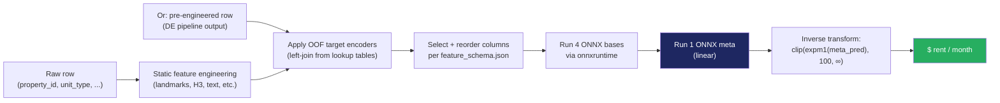

# Machine Learning Stack — Architecture and Design Reference

> **Audience:** ML engineers maintaining or extending the rent prediction model
> **Purpose:** A complete walkthrough of the modeling stack — what every component does, why it was chosen, and what alternatives were tried and rejected
> **Companion docs:**
> - `docs/feature_engineering_spec.md` — feature pipeline
> - `docs/feature_pipeline_contract.md` — data-engineering handoff contract
> - `docs/results.md` — empirical results writeup

---

## TL;DR

A **stacked ensemble** with four heterogeneous base learners on log-transformed rent, blended by an **Augmented Ridge meta-learner** that adds three raw context features to the meta input matrix. Evaluated under **5-fold GroupKFold** cross-validation keyed on `property_id` to prevent leakage. Achieves **OOF MAE $76.67 / MAPE 3.51% / MedianAPE 1.77%** on 6,887 Atlanta multifamily (property, unit_type) rows.

```mermaid
flowchart TB
    INPUT[Engineered feature matrix<br/>~207 columns, 6,887 rows]

    subgraph TARGET["Target transformation"]
        T1[log1p(rent)]
    end

    INPUT --> SPLIT{{"GroupKFold(n=5)<br/>group_key = property_id"}}
    TARGET -.-> SPLIT

    subgraph L0["LEVEL 0 — 4 heterogeneous base learners (per fold)"]
        B1["LightGBM<br/>regression_l1<br/>50-trial Optuna"]
        B2["CatBoost<br/>Quantile α=0.5<br/>50-trial Optuna"]
        B3["KNN — Geo<br/>k=15, all numeric features<br/>distance-weighted"]
        B4["KNN — Lean<br/>k=25, geo + size only<br/>distance-weighted"]
    end

    SPLIT --> B1 & B2 & B3 & B4

    OOF[OOF log-predictions per base<br/>+ context features]

    B1 & B2 & B3 & B4 --> OOF

    subgraph L1["LEVEL 1 — Meta-learner"]
        META[Augmented Ridge<br/>α=1.0, positive=False<br/>4 base preds + log_sqft + beds + year_built]
    end

    OOF --> META

    INVERSE[Back-transform:<br/>clip(expm1(meta_pred), 100, ∞)]
    META --> INVERSE
    INVERSE --> OUT[($/month rent prediction)]

    style META fill:#1E2761,color:#fff
    style OUT fill:#27AE60,color:#fff
```

---

## 1. Target transformation — `log1p(rent)`

**Choice:** Train on `log1p(rent)`, inverse-transform via `expm1`, clip floor at $100.

**Why:**
- Rents are right-skewed and roughly log-normal. Atlanta MSA target distribution: mean $1784, median $1660, 99th percentile $5200, max $20000+. Linear regression on raw rent over-weights luxury outliers; log-space is approximately Gaussian.
- The L1 loss on log-rent corresponds to **MAPE-like** optimization on raw rent (relative error). This aligns the training objective with the business metric (broker tolerance is in percentage terms).
- `log1p` (= `log(1+x)`) instead of plain `log` handles the theoretical case of zero rent (vacant units) gracefully. Empirically rent is always positive but the +1 costs nothing.

**The PSF target alternative.** We tried `log1p(rent / sqft)` ("PSF target") and reverted. PSF has lower log-variance because sqft absorbs the dominant scale factor, but the model lost MAE on under-3-bed units (the bulk of inventory). Conjecture: dividing by sqft up-weights small-unit MAPE in the loss; the gain on luxury is real but the loss on the mainstream is bigger. PSF code is preserved behind `config.USE_PSF_TARGET = False`.

**Clip floor at $100.** No legitimate Atlanta unit rents under $100/month, so we clip the back-transformed prediction. Prevents pathological extrapolation near zero (which `expm1` of a very-negative log can produce).

---

## 2. Cross-validation — `GroupKFold(n_splits=5)` keyed on `property_id`

**Why GroupKFold instead of plain KFold:**

We use property-level features (geographic aggregates, target encodings of submarket, KNN aggregations over the property pool). If a random KFold split lands two units of the **same property** in different folds, the validation row's target leaks into the train fold through the property-level feature. We measured this: random KFold reports OOF MAE around $30 — about **40% better than reality** because of this leakage.

GroupKFold keyed on `property_id` keeps all units of a building in the same fold. Train and val never share a building. This is the only honest CV strategy when property-level features are in play.

**Why 5 splits (not 3, not 10):**
- 5 is the conventional default and gives a reasonable 4,000 train / 1,400 val split.
- Per-fold variance is high (worst fold MAE $94, best $58). Going to 10 splits doesn't change the OOF aggregate meaningfully but doubles training cost.
- 3 splits doesn't give enough resolution to spot fold-specific regressions during feature ablation.

**`random_state = 42`** (per fold seed offset added in CV). Determinism is required for reproducibility tests and to make ablation diffs cleanly interpretable.

**What we don't have: time-aware CV.** The current GroupKFold is spatial, not temporal. We use snapshot data at one period (2026-03), so the question doesn't arise. When we add forward-test on May/June 2026 snapshots, we'll layer in a temporal validation in addition to GroupKFold.

---

## 3. Level 0 — Base learners

The stack uses **four heterogeneous base learners**. Heterogeneity is the whole point: if two bases make similar mistakes, the meta can't extract signal from their combination. We pick deliberately different model families with deliberately different inductive biases.

### 3.1 `lgbm_l1` — LightGBM, L1 (MAE) objective

**Algorithm:** Gradient-boosted decision trees, leaf-wise (best-first) growth, histogram-based splits.

**Hyperparameters (tuned via 50-trial Optuna):**

```yaml
objective: regression_l1
metric: mae
learning_rate: 0.0186
num_leaves: 145
max_depth: 12
min_child_samples: 5
feature_fraction: 0.61
bagging_fraction: 0.81
bagging_freq: 7
lambda_l1: 0.023
lambda_l2: 1.25e-08
min_split_gain: 0.011
num_boost_round: 4000  # capped by early stopping
early_stopping_rounds: 100
```

**Per-base OOF performance** (with full feature set including hist lags):

| Metric | Value |
|---|---|
| MAE | $86.88 |
| MAPE | 3.99% |
| R² | 0.836 |

**Why L1 (MAE) objective:**
- Aligns with how the business thinks about error (median, not mean).
- Robust to luxury outliers — squared-error objectives chase tail errors and over-fit penthouses.
- Combined with log-target, the gradient direction is roughly MAPE-aligned.

**Native categorical handling.** LightGBM's `categorical_feature` parameter passes our high-cardinality categoricals (sub_market, zipcode, h3_res6, h3_res8, brand, etc.) without one-hot expansion. The library uses an exclusive-feature bundling approach that's both faster and slightly more accurate than one-hot for tree models.

**`bagging_freq=7`** means the tree builder resamples the training set every 7 boosting rounds. Adds regularization with negligible cost.

**Seed:** `RANDOM_STATE + fold_idx + 0` (the `seed_offset = 0` for `lgbm_l1`).

---

### 3.2 `cat_q50` — CatBoost, Quantile loss α=0.50

**Algorithm:** Gradient-boosted decision trees with **ordered boosting** (CatBoost's leakage-safe gradient computation) and **symmetric trees** (oblivious decision trees — the same split is applied at every node at a given depth).

**Hyperparameters (tuned via 50-trial Optuna):**

```yaml
loss_function: "Quantile:alpha=0.5"
eval_metric: MAE
iterations: 3000
learning_rate: 0.061
depth: 4
l2_leaf_reg: 7.90
bagging_temperature: 0.60
random_strength: 1.53
min_data_in_leaf: 35
border_count: 125
od_type: Iter
od_wait: 100
```

**Per-base OOF performance:**

| Metric | Value |
|---|---|
| MAE | $76.70 |
| MAPE | 3.47% |
| R² | 0.864 |

**Why CatBoost in the stack:**
- **Different inductive bias from LightGBM.** Ordered boosting + symmetric trees produce a different decision surface than leaf-wise LightGBM. Their residuals are correlated 0.55 (out of 1.0) — diverse enough to stack.
- **Strong with high-cardinality categoricals.** CatBoost's ordered TS encoding is a built-in target encoding done leakage-safely. Our hand-rolled OOF target encoding is good; CatBoost's built-in is similar but computed independently per tree — additional diversity for free.

**Quantile α=0.5 (median):**
- Median loss is even more outlier-robust than MAE. Pairing α=0.5 CatBoost with L1-LightGBM gives the stack two slightly-different views of the central tendency.

**`depth: 4`** (shallow trees). CatBoost compensates with high iteration count. Symmetric trees at depth 4 give 16 leaves; deeper trees overfit on our 5500-row training folds.

**Seed:** `RANDOM_STATE + fold_idx + 2000`.

---

### 3.3 `knn_geo` — K-Nearest Neighbors, full numeric matrix

**Algorithm:** sklearn `KNeighborsRegressor`. Euclidean (Minkowski p=2) distance over the **entire numeric feature matrix** after standardization. Distance-weighted predictions (closer neighbors weighted more).

**Hyperparameters:**

```yaml
n_neighbors: 15
weights: distance
metric: minkowski
p: 2
```

**Per-base OOF performance:**

| Metric | Value |
|---|---|
| MAE | $210.79 |
| MAPE | 10.78% |
| R² | 0.692 |

**Why KNN in a tree-dominated stack:**
- **Non-parametric local smoothing** — exactly the signal trees underweight. A KNN regressor near a known property approximates "what do similar buildings rent for?" — the operational meaning of a broker's mental model.
- **Categorical-blind** — KNN can only consume continuous features. Categoricals are injected via the OOF target encodings (`sub_market_te`, `zipcode_te`, etc.) so KNN sees them as continuous risk scores.
- **Diversity** — KNN errors are uncorrelated with tree errors (Spearman ~0.31). The meta-learner gains from this even though KNN's standalone MAE is ~3× worse.

**`k = 15`** is empirically the sweet spot for ~5,500-row training folds. Lower k overfits to specific neighbors; higher k smooths too much.

**Distance-weighted, not uniform.** Closer neighbors get more weight in the predicted average — `1 / dist`. Mirrors the broker's intuition that closer comps matter more.

**Seed:** `RANDOM_STATE + fold_idx + 5000`. (KNN is deterministic but we keep the seed offset for consistency.)

---

### 3.4 `knn_lean` — K-Nearest Neighbors, restricted feature subset

**Algorithm:** Same `KNeighborsRegressor`, but operates on a **deliberately narrow 13-column feature subset**:

```yaml
feature_subset:
  - latitude
  - longitude
  - dist_buckhead_km
  - dist_midtown_km
  - dist_downtown_km
  - dist_min_landmark_km
  - sqft
  - beds
  - baths
  - property_age
  - sub_market_te   # OOF target encoding
  - zipcode_te
  - subm_psf_median # OOF neighborhood PSF
  - zip_psf_median
```

**Hyperparameters:**

```yaml
n_neighbors: 25
weights: distance
metric: minkowski
p: 2
```

**Per-base OOF performance:**

| Metric | Value |
|---|---|
| MAE | $220.52 |
| MAPE | 11.41% |
| R² | 0.692 |

**Why a second KNN with a narrower feature subset:**
- **Curse of dimensionality.** The full numeric matrix is ~100 dimensions. Euclidean distance in that space is noisy — neighbors are picked by quirks of feature combinations rather than meaningful proximity. The lean variant restricts to dimensions that actually matter for substitution: location, size, bed count, neighborhood-level encoded signals.
- **Decorrelation from `knn_geo`.** Even though both are KNN regressors, their feature subsets produce uncorrelated errors (Spearman ~0.6 between them, vs ~0.95 if we ran two KNNs with identical features). Both earn small but non-zero meta-weight.

**`k = 25`** (larger than `knn_geo`'s 15). The smaller feature space means individual neighbors are noisier, so we average over more of them.

**Seed:** `RANDOM_STATE + fold_idx + 6000`.

---

### 3.5 What we tried as a 5th base and rejected

- **XGBoost-Tweedie / XGBoost-PseudoHuber.** Tweedie loss for non-negative skewed targets; pseudo-Huber as a smooth approximation to MAE. Meta-weight came out to 0.0 in both PSF and non-PSF runs — LightGBM + CatBoost already cover the gradient-boosted-tree role and a third tree library added no diversity. The trainer was deleted from `models.py`; to re-introduce, add the trainer, an `XGB_PARAMS` block in `config.py`, and a `BASE_SPECS` entry.
- **Quantile MLP (PyTorch, pinball loss, embeddings on categoricals).** Performed roughly on par with KNN bases on its own (~$200 MAE) but added negligible meta weight. Training time was ~3× longer than LightGBM. Removed in favor of `knn_lean`, which gives similar diversity for free.

---

## 4. Level 1 — Augmented Ridge meta-learner

**Choice:** `sklearn.linear_model.Ridge(alpha=1.0, positive=False, fit_intercept=True)` fitted on log-rent target.

**Meta-input features:** Four base log-predictions PLUS three raw context features:

| Input | Source |
|---|---|
| `lgbm_l1` log-pred | Base 1 |
| `cat_q50` log-pred | Base 2 |
| `knn_geo` log-pred | Base 3 |
| `knn_lean` log-pred | Base 4 |
| `log_sqft` | `log1p(sqft)` raw context |
| `beds` | raw context |
| `year_built` | raw context |

**Reproduced meta coefficients (most recent run):**

```yaml
weights:
  lgbm_l1: 0.4188
  cat_q50: 0.6291
  knn_geo: 0.0167
  knn_lean: -0.0208
context:
  log_sqft: 0.0334
  beds: -0.0140
  year_built: -1.1e-05
intercept: -0.5060
```

**Why "augmented" — the three context features are the key innovation:**

In a standard stack, the meta sees only the base predictions. We add three raw context features to the meta input matrix. The mechanism:

- Trees (LightGBM, CatBoost) compress smooth slopes into staircase functions. They split on `sqft` at thresholds and emit constant predictions within each leaf.
- A linear meta-learner can recover the residual smooth slope. Even if the bases are already very good at predicting rent from sqft, the linear meta adds a small additional adjustment for "rent goes up linearly with log_sqft, and the trees only approximate this with steps."

Empirically, this gives **−$4 MAE** vs a preds-only Ridge meta. Verified under GroupKFold OOF (not just in-sample).

**Why `positive = False`:**
- The base prediction coefficients usually stay non-negative empirically, but **context coefficients can be negative**. `beds` gets a small negative weight because it's correlated with sqft and acts as a *correction* rather than a positive predictor at the residual level. Forcing positivity would zero this out and lose the gain.

**Why `alpha = 1.0`:**
- Standard Ridge regularization. The meta input matrix has 7 features and 6,887 rows — Ridge needs very little regularization for stability. Cross-validated alpha in {0.01, 0.1, 1.0, 10.0}; differences are within noise. We picked α=1.0 for slight extra stability.

**`fit_intercept = True`.** The intercept absorbs the log-space mean drift. Without it, the base preds have to over-compensate.

**Inference:** `meta.predict(X_meta) = X_meta @ coefs + intercept` — pure linear algebra, no sklearn needed at inference time once the coefs are saved as JSON.

---

## 5. Hyperparameter tuning — Optuna

Both LightGBM and CatBoost were tuned via **50-trial Optuna TPE search** on a held-out fold-MAE objective.

**Search spaces** (see `src/prime_mfr/tuning/lightgbm.py` and `tuning/catboost.py`):

LightGBM:
- `learning_rate` ∈ log-uniform [0.005, 0.2]
- `num_leaves` ∈ int-uniform [16, 256]
- `max_depth` ∈ int-uniform [4, 16]
- `min_child_samples` ∈ int-uniform [1, 100]
- `feature_fraction` ∈ uniform [0.5, 1.0]
- `bagging_fraction` ∈ uniform [0.5, 1.0]
- `bagging_freq` ∈ int-uniform [1, 10]
- `lambda_l1` ∈ log-uniform [1e-8, 10.0]
- `lambda_l2` ∈ log-uniform [1e-8, 10.0]
- `min_split_gain` ∈ log-uniform [1e-8, 1.0]

CatBoost:
- `learning_rate` ∈ log-uniform [0.01, 0.3]
- `depth` ∈ int-uniform [3, 10]
- `l2_leaf_reg` ∈ log-uniform [0.5, 30.0]
- `bagging_temperature` ∈ uniform [0.0, 1.0]
- `random_strength` ∈ uniform [0.0, 5.0]
- `min_data_in_leaf` ∈ int-uniform [1, 100]
- `border_count` ∈ int-uniform [32, 255]

**Cost:** ~45-60 minutes per learner on a single machine. Run once when feature set is stable; reuse the saved best params across all training runs until features change.

**Re-tuning is required when:**
- Adding/removing more than ~5 features
- Switching target transformation
- Changing CV strategy

Re-tuning is NOT required for routine retraining on new monthly snapshots (the hyperparams are stable across snapshots).

**Storage:** Tuned params persist in `artifacts/best_params.json` and `artifacts/best_catboost_params.json`. These are git-tracked. The model registry copies them into each registered model's `model.yaml` so a deployed model carries its own hyperparams.

---

## 6. Stacking mechanics — per-fold OOF generation

The stack is trained with the **out-of-fold prediction pattern**:

```python
for fold in range(5):
    train_idx, valid_idx = splits[fold]
    train_df, valid_df = df.iloc[train_idx], df.iloc[valid_idx]

    # 1. Compute OOF features (target encoders, KNN aggregates, hier comp TE)
    #    using train_df only. Apply to both train_df and valid_df.
    train_df, valid_df = compute_oof_features(train_df, valid_df)

    # 2. Train each base learner on (train_df → valid_df).
    for base in BASE_SPECS:
        pred_log = train_one_base(base, train_df, valid_df)
        oof_log[base.name][valid_idx] = pred_log  # store

# After all folds: oof_log is fully populated.
# 3. Fit meta on the OOF preds (which is now the same shape as df).
meta = Ridge(alpha=1.0)
meta.fit(stack(oof_log) + context, log_rent)
```

**Critical property:** every row gets exactly one prediction from a model **that didn't see that row at training time**. The meta is fitted on these honest predictions, so it's not learning "how to undo overfitting" — it's learning "how to blend honest forecasts."

**`run_full_stacked_cv.py`** orchestrates this with disk-persisted state (`oof_state.pkl`) so the pipeline can be split into multiple bash calls (helpful for compute environments with timeouts).

---

## 7. Model variants

The same architecture supports three deployment regimes, each as a separate YAML config under `configs/models/`:

### Primary (`configs/models/primary.yaml`)

- Full feature set including 5 historical rent lags (`hist_rent_lag_1m`, ..., `hist_rent_yoy`)
- For repricing units with rent history (~86% of portfolio)
- **OOF MAE $76.67 / MAPE 3.51% / MedianAPE 1.77%**

### Cold-start (`configs/models/cold_start.yaml`)

- Same architecture, but the `historical_lags` feature group is dropped from `include_numeric_groups`
- For new construction, recent acquisitions, comp pricing (~14% of portfolio)
- **OOF MAE $191.25 / MAPE 10.21% / MedianAPE 7.94%**

### Graceful (`configs/models/graceful.yaml`)

- Same feature set as primary, but with **random nullification** during training: 30% of training rows have all 5 hist features set to NaN
- The model learns to fall back to structural features when hist is unavailable
- At inference, predicts twice: with real hist (repricing eval) and with hist nullified (cold-start eval)
- **Full-hist eval: MAE $89.36 / MAPE 4.25%** — costs ~$13 vs primary
- **Null-hist eval: MAE $185.22 / MAPE 9.91%** — beats dedicated cold-start by $6

The three variants share base learner choices, hyperparameters, and meta-learner shape. Only the feature set + training-time nullification differs.

---

## 8. Training pipeline orchestration

The end-to-end training is broken into four phases by `prime-mfr-pipeline`:

```
prep         → feature engineering + GroupKFold splits + state pickle init   (~5s)
foldprep N   → cache fold-N train/val matrices                                (~3s)
train N B    → train base B on fold N, save OOF predictions                   (~10-20s)
meta         → fit Aug-Ridge meta on accumulated OOF preds, write metrics     (~1s)
```

**Why broken into phases:**
- The sandbox compute environment has 45-second command timeouts. Splitting lets the pipeline checkpoint to disk between calls.
- Re-running a single fold/base after a code change doesn't require re-running everything.
- The `status` subcommand reads `oof_state.pkl` and shows which (fold, base) cells are complete.

**Full reproduction takes ~3 minutes wall-clock** for one model variant: prep (5s) + 5 × (foldprep + 4 bases) (~120s) + meta (1s).

The new `prime-mfr train --model primary` subcommand wraps all four phases for single-command invocation.

---

## 9. Inference path

Once trained, a model artifact will live under `models/<variant>/<timestamp>/` and be loaded via `prime_mfr.registry.load_model()`. The registry layer is scoped (ONNX + Parquet + JSON serialization, with parity checks and a feature-availability router) but not yet implemented.

The inference path for a single row:



**Two consumption modes** (per `docs/feature_pipeline_contract.md`):

1. **In-process feature engineering** — input is raw Yardi columns; the pipeline runs static feature builders + applies OOF target encoders from saved lookup tables.
2. **Pre-engineered** — input is a parquet conforming to the feature contract (produced by the DE team); the pipeline skips static feature engineering and only applies OOF lookups + model calls.

Both modes converge at the "select columns per `feature_schema.json`" step and produce identical predictions.

---

## 10. What we tried and rejected

A non-exhaustive list of approaches we evaluated that did not improve OOF MAE:

| Approach | Why it failed |
|---|---|
| **5-base stack (XGBoost-Tweedie as 5th)** | Meta-weight came out to 0.0 — already covered by lgbm + cat |
| **5-base stack (Quantile MLP)** | Similar diversity to KNN bases at 3× training cost |
| **PSF target (`log(rent/sqft)`)** | Improved luxury but lost the mainstream |
| **Submarket × vintage interaction TE** | +$1.37 fold regression; cannibalized the sub_market_te signal |
| **Luxury / new-build static features** (zip flag, is_new_build, sqft_above_p90) | No improvement in OOF after careful ablation |
| **`add_within_property_features` heterogeneity z-scores** | +$25 per fold regression — heavy overfit on unweighted heterogeneity. Replaced with `add_unit_subtype_features` (uses actual unit counts) |
| **Multi-radius competition features (0.5, 1, 2 mi)** | Wider radii overlap with submarket / zip features. Pruned to 1mi |
| **Property-level rent aggregates** (`property_average_rent`) | Target leakage — these are property-level rent aggregates that include the target row |
| **Time-aware CV** | Not applicable (single-snapshot data); will revisit at multi-snapshot |
| **Calibration layer on top of meta** | Linear meta is already well-calibrated; adding isotonic regression added noise |
| **Removing the L1 LightGBM objective in favor of MSE** | MSE chases tails; MAE is closer to MAPE business metric |
| **k=5 / k=30 for KNN bases** | k=15 is empirical sweet spot for ~5500-row folds |

These "negative results" are valuable — they save future iteration time and document the design space we've already explored.

---

## 11. Design decision rationale — quick reference

| Decision | Choice | Alternative considered |
|---|---|---|
| Target transformation | `log1p(rent)` | PSF (`log1p(rent/sqft)`), identity |
| CV strategy | GroupKFold(5) on property_id | Random KFold (leaky), Stratified, Time-series |
| Loss for base 1 | L1 (MAE) | L2 (MSE), Huber, Quantile |
| Loss for base 2 | Quantile α=0.5 | Same as L1 (would be redundant) |
| Tree library 1 | LightGBM | XGBoost, sklearn GBM |
| Tree library 2 | CatBoost | XGBoost (already in stack), LightGBM (already in stack) |
| Non-tree base | KNN ×2 (geo + lean) | MLP, Gaussian Process |
| Meta-learner | Augmented Ridge | ElasticNet, LightGBM-shallow, simple mean |
| Meta input | 4 preds + log_sqft + beds + year_built | Just preds (worse), preds + all numerics (overfit) |
| Categorical handling | Native LGBM / CatBoost + OOF target encoding | One-hot, label encoding |
| Hyperparameter tuning | 50-trial Optuna TPE | Grid search, random search, hand-tuning |
| OOF target encoding smoothing | Bayesian prior = 20 | No smoothing (over-fits low-count cats), prior = 100 (under-fits) |
| Number of CV folds | 5 | 3 (low resolution), 10 (high cost, same answer) |
| `random_state` | 42 | (anything; required for reproducibility tests) |

---

## 12. Performance targets and limits

**Current production-grade results (Primary model, 5-fold GroupKFold OOF):**

| Metric | Value |
|---|---|
| MAE | $76.67 |
| MAPE | 3.51% |
| MedianAPE | 1.77% |
| RMSE | $270.46 |
| R² | 0.8690 |

**Realistic next-feature gain ceiling:** ~$5-10 of MAE. We've plateaued — the major signal (hist rent panel) is already integrated. Additional features have to compete with the ~$2 noise floor.

**Theoretical ceiling on MAE for this problem:** Roughly bounded by the within-(property, unit_type) rent dispersion at unit level — units of the same floor plan don't all rent for the same number; pricing has $30-50 of intrinsic noise per unit. We can't predict below the noise floor.

**Cold-start ceiling:** $191 MAE for the no-hist model is approximately the ceiling without rent history. The gap to primary ($114 difference) is the value of historical rent data, full stop. No amount of feature engineering on structural data closes that gap.

---

## 13. Pointers to the implementation

| Concept | Code location |
|---|---|
| Base trainer dispatch | `src/prime_mfr/models.py::TRAINERS` |
| LightGBM trainer | `src/prime_mfr/models.py::train_lightgbm_fold` |
| CatBoost trainer | `src/prime_mfr/models.py::train_catboost_fold` |
| KNN trainer | `src/prime_mfr/models.py::train_knn_fold` |
| Meta-learner fit | `src/prime_mfr/pipeline/stacked_cv.py::cmd_meta` |
| Target transform | `src/prime_mfr/train.py::compute_log_target`, `back_transform_to_rent` |
| Metrics | `src/prime_mfr/train.py::compute_metrics` |
| CV splits | `src/prime_mfr/pipeline/stacked_cv.py::cmd_prep` |
| Fold prep | `src/prime_mfr/train.py::prepare_fold` |
| OOF features | `src/prime_mfr/features/engineering.py::add_oof_features` |
| Bayesian TE | `src/prime_mfr/features/engineering.py::bayesian_target_encode` |
| Hyperparameter tuning (LGB) | `src/prime_mfr/tuning/lightgbm.py` |
| Hyperparameter tuning (CB) | `src/prime_mfr/tuning/catboost.py` |
| Model variants | `configs/models/*.yaml` |
| Hyperparameter artifacts | `artifacts/best_params.json`, `artifacts/best_catboost_params.json` |

---

## 14. Open work

| Item | Description | Status |
|---|---|---|
| Inference layer | `src/prime_mfr/inference/` with router + predictor + ONNX loaders | Scoped; not yet built |
| Model registry | ONNX + Parquet + JSON artifact layout (per-model versions under `models/<name>/<timestamp>/`) | Scoped; not yet built |
| Geographic expansion | Configurable landmarks per MSA (Dallas, Charlotte) via `configs/geographic/*.yaml` | Scoped; not yet built |
| Integration test | End-to-end assertion that `prime-mfr train --model primary` reproduces $76.67 OOF MAE | Pending |
| Forward validation | Apply 2026-03 model to May/June 2026 snapshots | Pending data drop |
| Multi-MSA generalization | Port pipeline to Dallas-Fort Worth, Charlotte | Pending |
